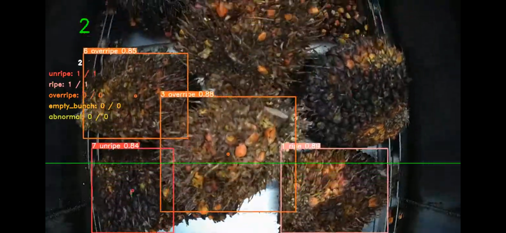

# 1. Sejarah dan definisi IoT

-   Sejarah  
    Konsep perangkat yang terhubung sendiri berasal dari tahun 1832 ketika telegraf elektromagnetik pertama dirancang. Telegraf memungkinkan komunikasi langsung antara dua mesin melalui transfer sinyal listrik.
    Namun, sejarah IoT yang sebenarnya dimulai dengan penemuan internet (komponen yang sangat penting) pada akhir 1960-an, yang kemudian berkembang pesat selama beberapa dekade berikutnya.
    Hingga akhirnya pada akhir abad ke-20, frasa “Internet of Things” diciptakan oleh Kevin Ashton.
    Kevin Ashton, yang merupakan salah satu pendiri Auto-ID Center di Massachusetts Institute of Technology (MIT), pertama kali menyebutkan internet of things dalam presentasi yang dia buat kepada Procter & Gamble (P&G) pada tahun 1999.

-   Definisi  
    Objek-objek di dunia nyata dengan sensor-sensor terhubung ke internet untuk memberikan informasi yang akurat.

# 2. Referensi model IoT

-   Physical Devices & Controlers  
    Merupakan komponen fisik atau perangkat keras dalam jaringan IoT.
-   Connectivity  
    Merupakan lapisan yang menghubungkan perangkat fisik dalam jaringan IoT.
-   Edge Computing  
    Merupakan lapisan di mana pemrosesan data dilakukan secara terdistribusi dan terdekat dengan perangkat fisik, yaitu di “edge” jaringan.
-   Data Accumulation  
    Merupakan tahap di mana data yang dikumpulkan dari perangkat fisik dan sensor diakumulasikan dan disimpan untuk analisis lebih lanjut.
-   Data Abstraction  
    Merupakan lapisan di mana data yang dikumpulkan diolah, diproses, dan diabstraksikan menjadi informasi yang relevan.
-   Application  
    Merupakan komponen yang menggunakan data dan informasi yang dihasilkan oleh sistem IoT untuk memberikan layanan dan fungsionalitas yang berbeda.
-   Collaboration & Processes  
    Merupakan aspek penting dalam model referensi IoT yang melibatkan kolaborasi antara perangkat dan sistem, serta proses yang melibatkan interaksi antara berbagai komponen.

# 3. Macam-macam kebutuhan IoT

-   Internet / Konektivitas
-   Keamanan
-   Backend / Cloud server
-   API
-   Sensor
-   Microcontroller
-   Monitoring

# 4. Contoh implementasi IoT

Deteksi kematangan kelapa sawit menggunakan kamera sebagai sensor

